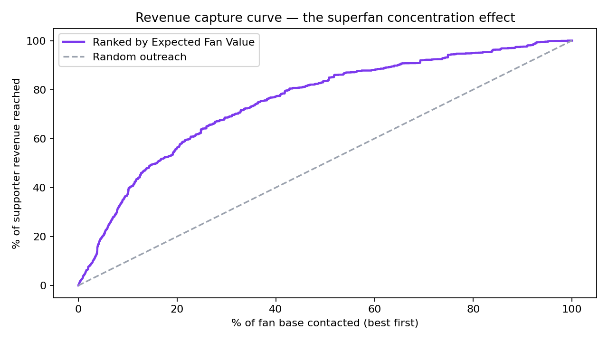
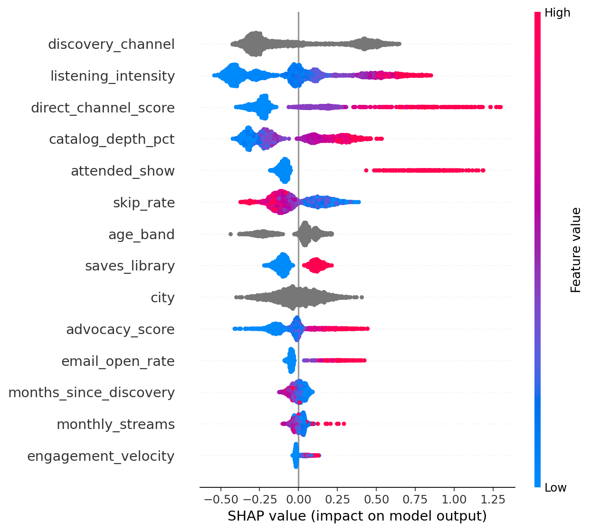

# Superfan Revenue Engine

**RevOps for independent artists** — treat a fan base like a sales pipeline.


Streams pay an independent artist ~€0.003 each. A superfan — vinyl, merch, gig tickets — is worth €30–300 a year. Yet indie marketing overwhelmingly chases streams, the *lowest-value* action a fan can take, because streams are what the dashboards show.

This engine applies B2B revenue science to that problem:

| Sales world | Music world |
|---|---|
| Lead scoring | **Fan scoring** — P(becomes paying supporter), with SHAP explanations |
| Customer lifetime value | **Expected Fan Value** = P(convert) × E[revenue \| convert] |
| Territory planning | **Demand-arbitrage tour optimizer** (integer programming) |

The strategy it encodes: *stop buying impressions, start identifying the ~200 people who would happily pay you €50/year — and tour the cities where you're underpriced, not the ones that sound impressive.*

## Results (holdout)

| Metric | Value |
|---|---|
| Fan conversion model ROC-AUC | **0.80** |
| Top-decile lift | **3.8×** base conversion rate |
| Revenue reached by contacting top 10% of fans (by EFV) | **~38%** |
| Tour optimizer vs. naive "biggest cities" plan | **+15% expected profit**, same budget |



Honest notes, because credibility beats hype: a logistic-regression baseline essentially ties XGBoost on this feature set (reported in `models/metadata.json`, not hidden), and AUC ≈ 0.80 is a realistic ceiling for behavior this noisy — a 0.99 here would mean target leakage.

## What the model learns



The engine independently rediscovers DIY-music folk wisdom and quantifies it per fan: **owned channels (mailing list) beat rented reach (follows)**, listening *depth* beats listening *volume*, live exposure converts, and editorial-playlist listeners are the cheapest fans you can acquire.

## The API

```bash
uvicorn app.api:app --reload     # docs at http://127.0.0.1:8000/docs
```

**Score a fan** — `POST /score-fan` with `examples/hot_fan.json`:

```json
{
  "fan_id": "F_DEMO",
  "superfan_probability": 0.9117,
  "expected_fan_value_eur": 38.44,
  "tier": "Superfan-ready",
  "recommended_action": "Personal invite: presale access, signed edition, direct thank-you.",
  "top_positive_drivers": [
    {"feature": "direct_channel_score", "value": "3.6", "shap_impact": 0.851, "direction": "increases score"},
    {"feature": "listening_intensity", "value": "38.64", "shap_impact": 0.7575, "direction": "increases score"}
  ]
}
```

**Plan a tour** — `POST /tour-plan` with `{"budget_eur": 12000, "min_cities": 6, "max_cities": 12}`:

```json
{
  "status": "Optimal",
  "cities": [
    {"city": "London", "expected_profit": 3605, "arbitrage_score": 0.0},
    {"city": "Leipzig", "expected_profit": 988, "arbitrage_score": 100.0},
    {"city": "Riga", "expected_profit": 819, "arbitrage_score": 95.1}
  ],
  "total_expected_profit_eur": 17776,
  "profit_uplift_vs_naive_eur": 2363
}
```

The optimizer keeps the profitable big rooms but swaps marginal capitals for **underpriced secondary markets** — cities where listeners-per-capita is unusually high and venues are cheap. That's the demand arbitrage big-city instinct misses.

## Project structure

```
├── src/
│   ├── generate_data.py   # synthetic fan base + city table (documented latent model)
│   ├── features.py        # feature engineering shared by training AND serving
│   ├── train.py           # conversion + revenue models, SHAP, lift, revenue capture
│   └── tour.py            # demand arbitrage scoring + ILP city selection (PuLP/CBC)
├── app/api.py             # FastAPI: /score-fan, /tour-plan, /health
├── notebooks/superfan_analysis.ipynb   # the full story, executed outputs
├── tests/                 # 16 tests: data, features, models, optimizer, API
├── models/                # trained artifacts, metadata, tour plan
├── data/                  # synthetic datasets (30,000 fans, 32 cities)
└── .github/workflows/ci.yml  # CI: regenerate → retrain → optimize → test
```

Design choices worth noting:

- **One feature module for train and serve** (`src/features.py`) — eliminates train/serve skew, the most common production ML bug.
- **Two-part value model.** Conversion probability and conditional revenue are modeled separately, then multiplied into Expected Fan Value — the standard actuarial decomposition, rarely seen in fan analytics.
- **Optimization, not just prediction.** The tour module turns model output into a *decision* under a budget constraint — the step most analytics portfolios skip.
- **CI retrains everything from scratch** on every push: data → models → tour plan → 16 tests.

## Run it yourself

```bash
git clone https://github.com/Olga-lab1/superfan-revenue-engine.git
cd superfan-revenue-engine
pip install -r requirements.txt

python src/generate_data.py                     # 30,000 synthetic fans + city table
python src/train.py                             # conversion + revenue models, SHAP
python src/tour.py --budget 12000 --min-cities 6  # optimized tour plan
python -m pytest tests/ -v                      # 16 tests
uvicorn app.api:app --reload                    # API at :8000
```

## Data & ethics

All data is **synthetic**, generated from a documented latent model (`src/generate_data.py`) — no real artists, fans, or platform data are used or scraped. Because the generating process is known, the model's sanity is *testable* (e.g. `test_known_signals_exist`). The approach is designed around first-party, consent-based data an artist already owns: their own mailing list, their own store, their own show attendance — not surveillance of listeners.

## License

MIT
